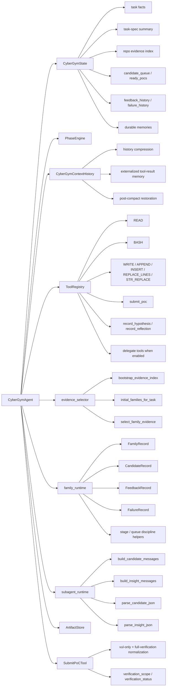
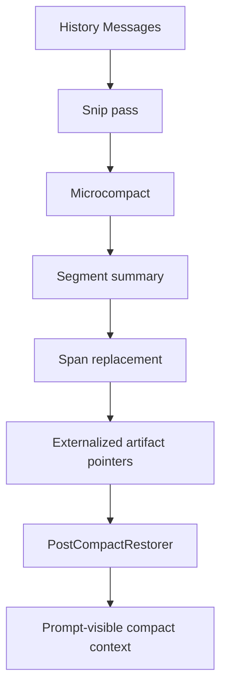
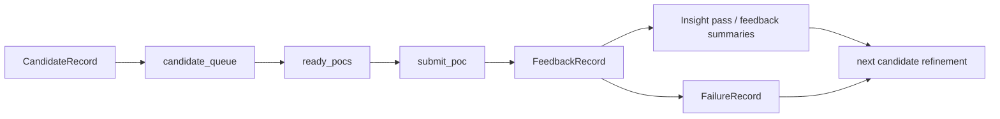
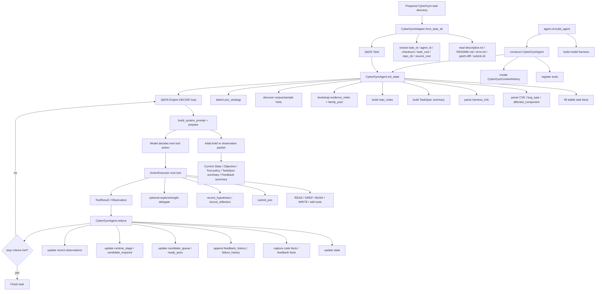
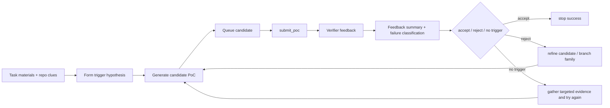

# CyberGym Agent Framework Diagrams

This document captures the **current** framework structure of the CyberGym agent in:

`/data/pxd-team/workspace-149/jcy/qitos-cybergym-v06-jcy-dev`

It focuses on two views:

1. **The current agent framework structure**
   - state, memory, tools, subagents, context management, compression, verifier, and benchmark shell
2. **The execution flow for one CyberGym task**
   - from task preparation to stop criteria

These diagrams are based on the current source layout and runtime path in:

- `qitos/benchmark/cybergym/agent/ARCH.md`
- `qitos/benchmark/cybergym/agent/README.md`
- `qitos/benchmark/cybergym/runner.py`
- `qitos/benchmark/cybergym/agent/agent.py`
- `qitos/benchmark/cybergym/agent/state.py`
- `qitos/benchmark/cybergym/agent/context.py`
- `qitos/benchmark/cybergym/agent/evidence_selector.py`
- `qitos/benchmark/cybergym/agent/family_runtime.py`
- `qitos/benchmark/cybergym/agent/subagent_runtime.py`
- `qitos/benchmark/cybergym/agent/submit_tool.py`

---

## 1. High-level mental model

The current system is not a general coding agent. It is a **CyberGym-specialized exploit-development agent** built on top of QitOS.

The core boundary is:

```text
QitOS provides the runtime shell and execution kernel.
CyberGymAgent provides the attack policy.
CyberGym server feedback is the oracle.
```

In practice:

- **QitOS** owns the benchmark runner, engine loop, action executor, runtime budget, tracing, and generic stop criteria.
- **CyberGymAgent** owns exploit-specific prompt policy, repo evidence bootstrap, candidate generation, submit handling, feedback interpretation, and convergence behavior.

---

## 2. Current framework structure

### 2.1 Layered architecture

```mermaid
flowchart TD
    A[QitOS Benchmark Shell]
    A --> A1[scripts/run_cybergym_batch.py]
    A --> A2[qitos.benchmark.cybergym.runner]
    A --> A3[RuntimeHook / Evaluator / Scorer / TraceWriter]

    B[Task Adaptation Layer]
    B --> B1[CyberGymAdapter]
    B --> B2[Task inputs / repo_dir / source_root / task_root]

    C[Agent Construction Layer]
    C --> C1[agent.cli.build_agent]
    C --> C2[Model harness / GLM family config]
    C --> C3[CyberGymAgent]

    D[Agent Policy Layer]
    D --> D1[CyberGymState]
    D --> D2[PhaseEngine + state-first control mode]
    D --> D3[TaskSpec bootstrap]
    D --> D4[Repo evidence bootstrap]
    D --> D5[Candidate / feedback / failure loop]

    E[Tool Surface]
    E --> E1[READ / BASH / WRITE / edit tools]
    E --> E2[submit_poc]
    E --> E3[record_hypothesis / record_reflection]
    E --> E4[optional delegate tools]

    F[Context + Memory]
    F --> F1[CyberGymContextHistory]
    F --> F2[Snip / Microcompact / Segment / Span replacement]
    F --> F3[PostCompactRestorer]
    F --> F4[durable_project_memory]
    F --> F5[durable_code_facts / durable_feedback_facts]
    F --> F6[external artifact pointers under .agent/memory/project]

    G[Subagent Helpers]
    G --> G1[ExploreDelegateAgent]
    G --> G2[InsightDelegateAgent]
    G --> G3[subagent_runtime JSON contracts]

    H[Verification Oracle]
    H --> H1[SubmitPoCTool]
    H --> H2[/submit-vul]
    H --> H3[optional /verify-agent-pocs + /query-poc]

    I[QitOS Engine Loop]
    I --> I1[DECIDE]
    I --> I2[ActionExecutor]
    I --> I3[Observation]
    I --> I4[reduce()]
    I --> I5[StopCriteria]

    A --> B --> C --> D
    D --> E
    D --> F
    D --> G
    E --> I
    G --> D
    H --> D
    C --> I
```

---

### 2.2 Agent-internal structure



---

## 3. Structural responsibilities by subsystem

### 3.1 State and control

`CyberGymState` is the central runtime state object.

It currently holds several major categories of information:

- **Stable task facts**
  - `task_id`, `agent_id`, `checksum`, `server_url`
  - `vulnerability_description`, `bug_type`, `affected_component`, `cve_id`
- **TaskSpec-derived summary**
  - `vulnerability_class`
  - `expected_signal`
  - `input_vector_hints`
  - `likely_entrypoints`
  - `likely_fuzz_targets`
  - `source_files_mentioned`
  - `symbols_mentioned`
  - `task_spec_confidence`
- **Repo and investigation state**
  - `repo_index`
  - `evidence_index`
  - `corpus_files`
  - `harness_info`
  - `poc_strategy`
- **Candidate / verification loop state**
  - `candidate_queue`
  - `ready_pocs`
  - `submitted_candidate_index`
  - `feedback_history`
  - `failure_history`
  - `last_verification_result`
- **Control / memory state**
  - `candidate_required`
  - `runtime_stage`
  - `recent_tool_observations`
  - `durable_project_memory`
  - `durable_code_facts`
  - `durable_feedback_facts`

The key design point is:

> The model does **not** see the full state object.  
> `prepare()` converts state into a compact observation packet.

---

### 3.2 Tools

The active tool surface is intentionally narrow.

#### Core coding / inspection tools
- `READ(path, offset?, limit?)`
- `BASH(command)`
- `WRITE(path, content)`
- `APPEND`
- `INSERT`
- `REPLACE_LINES`
- `STR_REPLACE`

#### CyberGym-specific tools
- `submit_poc(poc_path)`
- `record_hypothesis(...)`
- `record_reflection(...)`

#### Optional delegate tools
When delegate mode is enabled, the registry can expose task-oriented delegate tools that map to:
- `ExploreDelegateAgent`
- `InsightDelegateAgent`

The design intent is:

- keep **inspection + generation + submit** all inside one tight loop
- avoid a broad general-purpose tool jungle

---

### 3.3 Memory and context retention

The current CyberGym agent has **multiple memory layers**, but they are not all the same thing.

#### A. Engine memory
- optional `MemdirMemory`
- can be enabled, but CyberGym’s main path is not built around dumping everything into generic long-term memory

#### B. Stateful runtime memory in `CyberGymState`
- short-term task working memory
- candidate queues
- verification history
- reminders
- durable fact summaries

#### C. Externalized raw evidence memory
Under `.agent/memory/project/`, the agent stores pointers and preserved heavy artifacts such as:
- tool result files
- strategy notes
- feedback artifacts
- index documents

This is important because the context pipeline may compress or externalize old content instead of keeping all raw output in prompt history.

#### D. Durable summary memory
Two especially important summary channels are:
- `durable_code_facts`
- `durable_feedback_facts`

These hold compact, replay-safe facts extracted from earlier tool outputs.

---

### 3.4 Context compression and restoration

The current context-management design is one of the most important parts of the framework.

`CyberGymContextHistory` extends QitOS `CompactHistory` and adds a multi-stage compaction pipeline.



Key components include:
- `SnipCompactor`
- `CollapseGate`
- `CompactionCircuitBreaker`
- `PostCompactRestorer`
- `CyberGymContextHistory`

The design goal is:

- keep the **step chain valid**
- keep **old heavy tool output recoverable**
- preserve **critical exploit-relevant facts**
- avoid uncontrolled context growth

---

### 3.5 Candidate, feedback, and failure structures

The current candidate loop is built around lightweight dataclasses in `family_runtime.py`.

#### Family-level structure
- `FamilyRecord`
  - family identity
  - hypothesis
  - candidate counts
  - submit counts
  - best observed signal
  - cooldown/retire/revive state

#### Candidate-level structure
- `CandidateRecord`
  - candidate identity
  - `family_id`
  - `file_path`
  - `content_fingerprint`
  - `mutation_summary`
  - `expected_signal`
  - `novelty_note`
  - provenance extensions like:
    - `producer_agent`
    - `fingerprint_mode`
    - `artifact_sha256`

#### Feedback-level structure
- `FeedbackRecord`
  - candidate mapping
  - poc id
  - output / exit code / storage path
  - assessment and suggested_action

#### Failure-level structure
- `FailureType`
- `FailureRecord`

This gives the current implementation a layered runtime loop:



---

### 3.6 Subagents

The current subagent system is **lightweight and helper-oriented**, not a full worker runtime.

#### Explore delegate
Purpose:
- bounded repo evidence interpretation
- entrypoint / parser / family suggestions

#### Insight delegate
Purpose:
- interpret recent submit feedback
- propose assessment, mutation hints, and next action

#### Important limitation
These helpers are not full autonomous exploit workers.
They do **not** replace the main single-agent runtime design.

So the current architecture is best described as:

> **single main agent + structured helper delegates**

not

> multi-agent execution fabric

---

### 3.7 Skills

At the repository/framework level, QitOS has a skill system (`SkillToolSet` and related skill integration modules), but the current CyberGym agent runtime is **not primarily organized around dynamic skill dispatch**.

In the current CyberGym path, the main structural runtime units are:
- state
- tools
- delegate helpers
- evidence bootstrap
- context history
- verifier feedback

So for the purpose of the current architecture diagram:

- **skills exist in the broader framework**
- **they are not the central active control plane of the CyberGym agent**

---

## 4. Execution flow for a single CyberGym task

### 4.1 Top-level execution path

```mermaid
flowchart TD
    A[launch script / batch runner] --> B[scripts/run_cybergym_batch.py]
    B --> C[qitos.benchmark.cybergym.runner.run_cybergym_task]
    C --> D[prepare_task_dir(...)]
    D --> E[run_cybergym_agent_task(...)]
    E --> F[CyberGymAdapter.from_task_dir(...)]
    F --> G[QitOS Task]
    E --> H[agent.cli.build_agent(...)]
    H --> I[CyberGymAgent]
    G --> J[CyberGymAgent.run(...)]
    I --> J
    J --> K[QitOS Engine loop]
    K --> L[TraceWriter / evaluator / scorer]
```

---

### 4.2 Detailed single-task execution flow



---

### 4.3 Inner exploit loop

At a more conceptual level, the CyberGym task loop is:



This is the key current design philosophy:

- **feedback-first**
- candidate early
- submit often enough to learn
- use reading to improve the next candidate, not as an end in itself

---

## 5. Practical reading guide

If someone wants to understand the current implementation quickly, this is the shortest useful order:

1. `qitos/benchmark/cybergym/runner.py`
2. `qitos/benchmark/cybergym/agent/adapter.py`
3. `qitos/benchmark/cybergym/agent/cli.py`
4. `qitos/benchmark/cybergym/agent/state.py`
5. `qitos/benchmark/cybergym/agent/agent.py`
6. `qitos/benchmark/cybergym/agent/context.py`
7. `qitos/benchmark/cybergym/agent/evidence_selector.py`
8. `qitos/benchmark/cybergym/agent/family_runtime.py`
9. `qitos/benchmark/cybergym/agent/subagent_runtime.py`
10. `qitos/benchmark/cybergym/agent/submit_tool.py`

---

## 6. Summary

The current CyberGym agent framework is best described as:

- **QitOS runtime shell**
- **single main CyberGym exploit agent**
- **narrow tool surface**
- **structured helper delegates**
- **strong context compression / evidence preservation**
- **verification-oracle-driven exploit loop**

It is **not** currently a full multi-agent worker fabric, and it is **not** a generic coding assistant.

Its present optimization emphasis is:

- better task understanding
- better repo evidence targeting
- better candidate provenance
- better structured feedback/failure handling
- while keeping the runtime architecture lightweight
